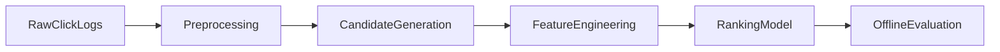

# News Recommender System (30-second recruiter view)

Built a news recommender system to predict users' next-clicked article from historical click logs using candidate generation and ranking baselines.

## Results First

### Dataset Size
- Train clicks: **1,112,623** rows (**200,000** users)
- TestA clicks: **518,010** rows (**50,000** users)
- TestB clicks: **776,657** rows (**50,000** users)
- Articles: **364,047**

### Task Definition
Given each user's historical click sequence, predict the most likely next-clicked article.

### Offline Metrics (summary)
- Evaluation protocol: Recall-style candidate evaluation and top-K ranking quality checks.
- Core metrics: **Recall@20**, **MRR@20**, **HitRate@20**
- Evaluation setup: leave-one-out validation on **5,000 sampled training users**.

### Best Model vs Baseline
- Best Recall@20: **ItemCF (0.4962)** vs **Popularity baseline (0.4326)**, absolute gain **+0.0636**.
- Best MRR@20: **ItemCF (0.2118)** vs **Popularity baseline (0.1418)**, absolute gain **+0.0700**.

### Top Business Takeaway
- Even simple retrieval + ranking decomposition gives a practical path from prototype to deployable recommendation systems.

## Method Framework



- **Candidate generation** narrows the search space from all articles to a relevant top-K set.
- **Feature engineering + ranking** estimates fine-grained click likelihood among candidates.
- **Offline evaluation** quantifies retrieval and ranking quality before any online deployment.

## Experiment Results

| Model | Recall@20 | MRR@20 | HitRate@20 |
| :-- | --: | --: | --: |
| Popularity baseline | 0.4326 | 0.1418 | 0.4326 |
| ItemCF | 0.4962 | 0.2118 | 0.4962 |
| Embedding recall | 0.2458 | 0.0566 | 0.2458 |
| Ranker (hybrid) | 0.4574 | 0.1921 | 0.4574 |

Metric source: exported from `notebook/Model.ipynb` offline evaluation section.

## Project Structure
- `notebook/`
  - `Data_Analysis.ipynb`: data exploration and preprocessing flow.
  - `Model.ipynb`: candidate generation and ranking prototype.
- `data/`
  - `data_raw/`: place raw dataset files here (ignored by Git).
  - `temp_results/`: generated intermediate/result files (ignored by Git).

## Required Data Files
Put the following files under `data/data_raw/` before running notebooks:
- `train_click_log.csv`
- `testA_click_log.csv`
- `testB_click_log.csv`
- `articles.csv`
- `articles_emb.csv`

## Run
1. Create a Python environment (3.9+ recommended).
2. Install dependencies:
   ```bash
   pip install -r requirements.txt
   ```
3. Open notebooks from the repository root:
   - `notebook/Data_Analysis.ipynb`
   - `notebook/Model.ipynb`

## Notes
- This repository tracks source notebooks and code only.
- Large raw data files and generated outputs are excluded from version control.
